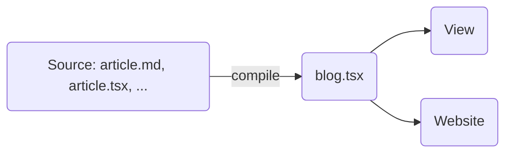

# Justlog 博客设计

## Ⅰ. 需求

### 1.1 作者视角

基本流程:

1. 安装写作环境:

    执行一个 shell 或 powershell 脚本, 完成安装, 并把路径添加到 PATH, 使各项命令可用.

2. 执行 `justlog new "example-blog"` 创建一篇新博客. 该命令创建了一个博客模板:

    ```
    <root>/example-blog/
        article.md              - 博客内容
        article.tsx             - 博客的配置与脚本
    ```

3. 完成博客的写作后, 在目录 `<root>/example-blog/` 下可执行以下命令:

    - `justlog build`: 构建
    - `justlog view`: 通过本地服务器预览
    - `justlog publish`: 发布博客

关于博客的模板及编写的说明, 见 2.1 节.

### 1.2 读者视角

功能:

- 颜色主题:
    - 深色/浅色
    - 自动按时间调整
- 翻译
    - 可翻译到支持的语言
    - 根据用户浏览器语言, 提示翻译
    - 全文翻译/逐个段落对照
    - 可申请修改翻译
- 集成功能:
    - (打印) 导出为 PDF
    - 流程图
    - 脑图: XMind, MindMaster, ...
    - 笔记软件: OneNote, 印象笔记, MarginNote, ...
- 手写笔
- 分享
- 评论:
    - 文末评论
    - 段落旁评论
- LaTeX 支持
- 代码片段
- 大纲

## Ⅱ. 架构

### 2.1 基本流程




### 2.2 作者电脑上的文件结构

博客目录结构:

```
<root>/                             - 博客根文件夹, 应存储在云盘
    .justlog/
        setting.json
        track.json
    2022.01/                        - 例: 2022 年 1 月写的所有文章的文件夹
    2022.02/                        - 例: 2022 年 2 月写的所有文章的文件夹
        hello-justlog/              - 一篇名为 hello-justlog 的博客, 写就于 2022.02
            该篇博客的一些文件......
    example-blog/                   - 一篇名为 example-blog 的博客, 正在编写中...
        article.md
        article.tsx
        res/                        - 静态资源
            cat.jpg
            dog.pdf
```


一篇 Blog 的构成:

**`<blog_dir>/article.md`**
- 格式
    - Encoding: UTF-8
    - Indent: 4 spaces
    - Line ending: LF
    - Lang: JustMark
- (可选) Blog 的元信息
    - 放于文件头, 内容为 TOML 语言

        e.g.
        ````toml
        ```blog
        copyright = 'CC BY-ND 4.0'
        topics = ['rust', 'net']
        ```
        ````
- Blog 的内容
    - 默认地, 第一个一级标题将成为 Blog 的标题
    - 嵌入 React 组件
        - 预定义的 React 组件
        - 临时 React 组件
    - 特殊语法
        - 翻译指示
- 依赖的静态资源
    - 全局的
        - 映射层 `/global-static/(.*)`
        - 物理存储层
            - 若存在, 优先外链
            - `<root>/global-static/(.*)` 存储在 www 服务器
    - "carry-on": 放入 `<blog_dir>/res/` 文件夹内, 通过 `./res/*` 引用
        - 与图床服务集成, 自动上传图片, 替换链接
    - 已归档的 blog 的 "carry-on" 静态资源, 引用方式: e.g. `/2021.12/hello-world/res/*`
    - 其他静态资源: 外链, 嵌入播放器, ...
